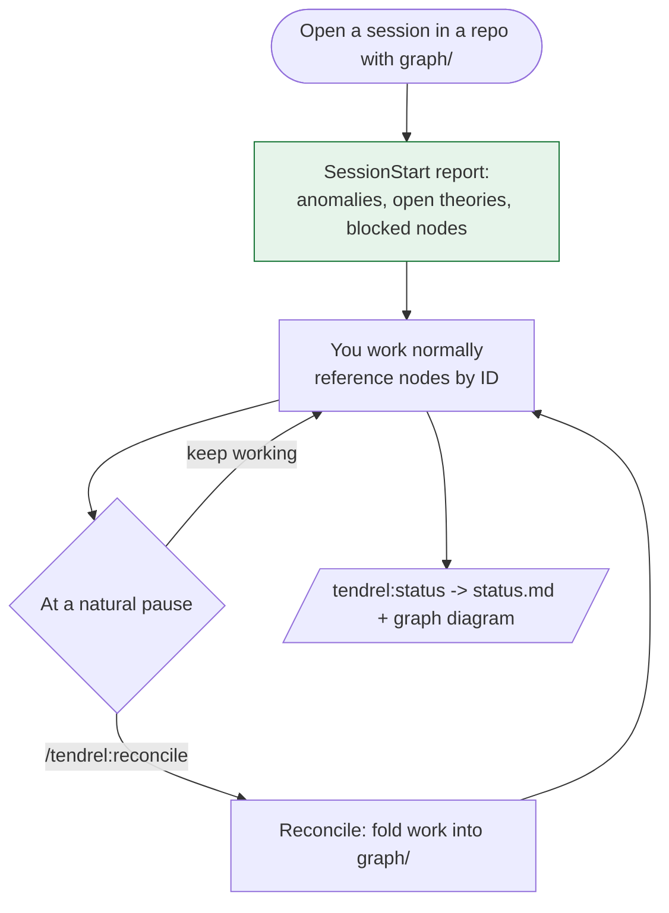

# tendrel

> **tendrel** (རྟེན་འབྲེལ) — *Tibetan: "dependent arising."* Nothing in your research stands
> alone. Tendrel tracks what every conclusion rests on — and what falls when it doesn't hold.

A research graph for [Claude Code](https://claude.com/claude-code). A memory gives your agent
recall; **tendrel gives your research a state** — what's tested, what's validated, what's
blocked, and what's affected when a result changes. It lives as plain markdown *inside your
project repo*: no daemon, no database, no binary.

## Automatic or on-demand? (the short answer)

Exactly **one** thing happens automatically. Everything else you invoke — by slash command or
by just talking. Nothing ever interrupts you mid-task.

| | When it happens | What it does |
|---|---|---|
| **SessionStart report** | **Automatic** — every session opened in a repo that has a `graph/` dir | Injects an anomaly-led summary: node count, nodes with empty bodies, `depends_on` edges pointing at missing nodes, open theories, unvalidated/blocked pipeline nodes. Silent in any repo without `graph/`. |
| **Reconcile** | On demand — `/tendrel:reconcile` or *"reconcile the graph"* | Folds recent work into `graph/`: new/updated nodes, status transitions, edges; traces downstream on an invalidation; appends friction. |
| **Status view** | On demand — `/tendrel:status` or *"regenerate status.md"* | Regenerates `status.md`: a mermaid diagram of your graph + text sections (theories by stage, nodes by evidence status, decisions, ideas). |
| **Seed** | On demand — `/tendrel:seed` or *"seed the graph"* | Guided first-population of an empty graph from your project's current state; proposes nodes for approval before writing. |
| **Dependency query** | On demand — natural language | *"what depends on NODE-004?"* / *"what's blocking THEORY-002?"* — traversal over the typed edges. |
| **Wiki ingest** | On demand — natural language | *"fold `raw/paper.pdf` into the wiki"* — reference knowledge into `wiki/` concept pages. |

The behavior contract for all of it lives in one skill (`plugin/skills/research-graph/SKILL.md`);
the commands and natural language are just two doors into the same room.

## The session loop



Green is the one automatic step; everything else is you choosing to invoke it.

## The node model

Six kinds of typed node, connected by seven directed edge relations. See a real one rendered
in [`examples/doc-search/status.md`](examples/doc-search/status.md) (GitHub draws the graph inline).


| Kind | ID | Lifecycle |
|---|---|---|
| `experiment` | `EXP-` | planned · running · complete · abandoned |
| `theory` | `THEORY-` | idea · backtest · paper_trade · live_small · live_full · shelved |
| `pipeline_node` | `NODE-` | untested · assumed_working · validated · invalidated · blocked |
| `decision` | `DEC-` | active · under_review · reversed |
| `idea` | `IDEA-` | open · promoted · dropped |
| `observation` | `OBS-` | — |

An **annotated node** — YAML frontmatter (flat, one field per line) + a lab-notebook body:

```markdown
---
id: EXP-002                          # human-readable, zero-padded, per-(project, kind)
kind: experiment                     # one of the six kinds
status: complete                     # from that kind's lifecycle
question: "Does hybrid beat vector-only?"
config: {retriever: hybrid, n: 200}  # per-kind attributes (flat inline map)
result: "nDCG@10 0.71 (+10 pts)"
edges:                               # typed, directed edges to other nodes (or wiki/ paths)
  - {rel: validates, to: THEORY-001}     # this experiment supports a theory
  - {rel: invalidated_by, to: NODE-003}  # ...and undermines a pipeline node
---
Hybrid wins clearly; supersedes the vector-only retriever.   # the body: your lab notes
```

Full reference: [`docs/node-model.md`](docs/node-model.md). How it all works under the hood:
[`docs/how-it-works.md`](docs/how-it-works.md). Task-shaped walkthroughs:
[`docs/recipes.md`](docs/recipes.md).

## See it

<!-- MEDIA:report -- SessionStart report GIF/screenshot (added in U6) -->
*The SessionStart report opening a session (screenshot coming — see `docs/recipes.md` for the text form meanwhile).*

<!-- MEDIA:reconcile -- reconcile GIF (added in U6) -->
*A reconcile folding a finished experiment into the graph (GIF coming).*

## Install

```
/plugin marketplace add havocy28/tendrel
/plugin install tendrel@tendrel
```

Then scaffold any repo you want to use it in:

```bash
bash setup-research-repo.sh <repo-path> <project-name>   # from a clone of this repo
```

(or just create `raw/`, `wiki/`, `graph/` folders and a `.research-graph` file containing
`project = <name>`). Enable the plugin for that project, start a new session, and you'll see the
report. The hooks are scoped: they do nothing in a repo without a `graph/` directory, so the
plugin is safe to leave installed everywhere.

## Quickstart (first ten minutes)

1. Install + scaffold, then open a session in that repo.
2. `/tendrel:seed` — the guided flow reads your project and proposes nodes for your review before
   writing anything. Correct them; it writes `graph/`.
3. Work normally; reference nodes by ID (*"does this invalidate NODE-004?"*).
4. At a natural pause: `/tendrel:reconcile`.
5. `/tendrel:status` anytime for the one-screen view + graph diagram.

## Plugin data (`CLAUDE_PLUGIN_DATA`)

Tool-global state lives in the plugin data directory (outside your repos):

- `FRICTION.md` — a running log of what's annoying about the system itself, appended during
  reconciles. It drives the roadmap: upgrades below are triggered by logged friction, not by the
  calendar.

## Roadmap (triggered, not scheduled)

- **SQLite + MCP server** (added to this plugin) — when file-scan traversal strains or the
  dangling-edge audit fires repeatedly.
- **Wiki search** — when the wiki outgrows file-reading.

## Development history

The core bet — that a Claude Code hook can reliably drive the model to *reconcile* a graph, not
merely respond — was validated empirically before anything was built on it. See
[`docs/history/SPIKE.md`](docs/history/SPIKE.md).
