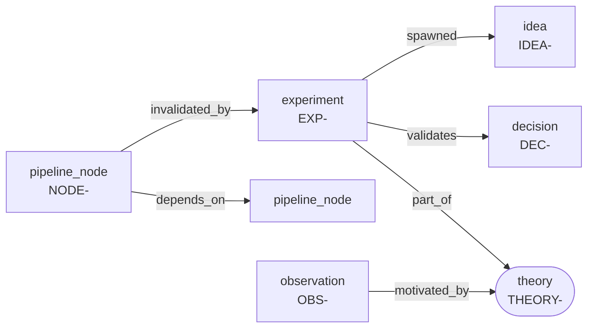

# tendrel

> **tendrel** (རྟེན་འབྲེལ), *Tibetan: "dependent arising."* Nothing in your research stands
> alone. Tendrel tracks what every conclusion rests on, and what falls when it doesn't hold.

A research graph for [Claude Code](https://claude.com/claude-code). A memory gives your agent
recall. **Tendrel gives your research a state**: what's tested, what's validated, what's blocked,
and what falls over when a result changes. It lives as plain markdown *inside your project repo*,
with no daemon, no database, and no binary.

## Why tendrel exists

Tendrel came out of running real research with agents, where results kept getting forgotten
between sessions, several experimental paths were in flight at once, and the actual goal kept
moving as findings came in. Agents are sharp within a session but lose the thread across them, so
decisions get made on a stale picture of what's been tried, what held up, and what that means for
where you're headed.

Each frustration maps onto something tendrel does about it:

| The frustration | What tendrel does |
|---|---|
| Agents forget results and state across sessions | The graph persists results as typed nodes in the repo; the SessionStart report resurfaces them every session |
| Multiple paths in flight at once | Theories and experiments are parallel typed containers, so the graph shows every live path in one view |
| The destination keeps moving as results land | Dependency edges plus invalidation: when a result changes, tendrel traces what is now blocked or untrustworthy, so the target re-derives from evidence instead of drifting |

## How it's different

- **vs. agent memory:** memory recalls facts you told it. Tendrel holds the *state of the work*:
  what's validated, blocked, or in flight, updated as results land.
- **vs. notes tools (Obsidian, Roam):** those store knowledge you curate by hand. Tendrel is
  work-state the agent maintains as you go, with evidence lifecycles.
- **vs. experiment trackers (W&B, MLflow):** those log runs and metrics on a server. Tendrel is
  plain markdown in your repo that tracks how conclusions *depend on each other*, so when one
  result changes you see what downstream is now in question.

The distinctive part: because the destination evolves with the evidence, tendrel makes the
dependencies explicit. Invalidate one node and it traces everything that rested on it. That's the
piece the rest of the agent toolchain doesn't do.

## Automatic or on-demand? (the short answer)

Exactly **one** thing happens automatically. Everything else you invoke, by slash command or by
just talking. Nothing ever interrupts you mid-task.

| | When it happens | What it does |
|---|---|---|
| **SessionStart report** | **Automatic**, every session opened in a repo that has a `graph/` dir | Injects an anomaly-led summary: node count, nodes with empty bodies, `depends_on` edges pointing at missing nodes, open theories, unvalidated/blocked pipeline nodes. Silent in any repo without `graph/`. |
| **Reconcile** | On demand, `/tendrel:reconcile` or *"reconcile the graph"* | Folds recent work into `graph/`: new/updated nodes, status transitions, edges; traces downstream on an invalidation; appends friction. |
| **Status view** | On demand, `/tendrel:status` or *"regenerate status.md"* | Regenerates `status.md`: a mermaid diagram of your graph plus text sections (theories by stage, nodes by evidence status, decisions, ideas). |
| **Seed** | On demand, `/tendrel:seed` or *"seed the graph"* | Guided first-population of an empty graph from your project's current state; proposes nodes for approval before writing. |
| **Dependency query** | On demand, natural language | *"what depends on NODE-004?"* / *"what's blocking THEORY-002?"*, traversal over the typed edges. |
| **Wiki ingest** | On demand, natural language | *"fold `raw/paper.pdf` into the wiki"*, reference knowledge into `wiki/` concept pages. |

The behavior contract for all of it lives in one skill (`plugin/skills/research-graph/SKILL.md`);
the commands and natural language are just two doors into the same room.

## The session loop


Green is the one automatic step; everything else is you choosing to invoke it.

## The node model

Six kinds of typed node, connected by seven directed edge relations. See a real one rendered
in [`examples/doc-search/status.md`](examples/doc-search/status.md) (GitHub draws the graph inline).



| Kind | ID | Lifecycle |
|---|---|---|
| `experiment` | `EXP-` | planned · running · complete · abandoned |
| `theory` | `THEORY-` | idea · backtest · paper_trade · live_small · live_full · shelved |
| `pipeline_node` | `NODE-` | untested · assumed_working · validated · invalidated · blocked |
| `decision` | `DEC-` | active · under_review · reversed |
| `idea` | `IDEA-` | open · promoted · dropped |
| `observation` | `OBS-` | (none) |

An **annotated node** is YAML frontmatter (flat, one field per line) plus a lab-notebook body:

```markdown
---
id: EXP-002                          # human-readable, zero-padded, per-(project, kind)
kind: experiment                     # one of the six kinds
status: complete                     # from that kind's lifecycle
question: "Does hybrid beat vector-only?"
config: {retriever: hybrid, n: 200}  # per-kind attributes (flat inline map)
result: "nDCG@10 0.71 (+10 pts)"
edges:                               # typed, directed edges to other nodes (or wiki/ paths)
  - {rel: validates, to: THEORY-001}     # this experiment supports a theory
  - {rel: invalidated_by, to: NODE-003}  # ...and undermines a pipeline node
---
Hybrid wins clearly; supersedes the vector-only retriever.   # the body: your lab notes
```

Full reference: [`docs/node-model.md`](docs/node-model.md). How it all works under the hood:
[`docs/how-it-works.md`](docs/how-it-works.md). Task-shaped walkthroughs:
[`docs/recipes.md`](docs/recipes.md).

## See it

The example graph renders right here on GitHub, no screenshots needed. Open
[`examples/doc-search/status.md`](examples/doc-search/status.md) and GitHub draws the dependency
graph inline (invalidated and blocked nodes highlighted), with the grouped text sections below it.

Want to watch it work? Follow the [walkthrough](docs/walkthrough.md): scaffold the example graph,
open a session, ask "what should I look at first?", finish an experiment, and run
`/tendrel:reconcile` to see the graph update itself. Every command is real and every output
renders in your terminal.

## Install

```
/plugin marketplace add havocy28/tendrel
/plugin install tendrel@tendrel
```

Then scaffold any repo you want to use it in:

```bash
bash setup-research-repo.sh <repo-path> <project-name>   # from a clone of this repo
```

(or just create `raw/`, `wiki/`, `graph/` folders and a `.research-graph` file containing
`project = <name>`). Enable the plugin for that project, start a new session, and you'll see the
report. The hooks are scoped: they do nothing in a repo without a `graph/` directory, so the
plugin is safe to leave installed everywhere.

## Quickstart (first ten minutes)

1. Install and scaffold, then open a session in that repo.
2. `/tendrel:seed`: the guided flow reads your project and proposes nodes for your review before
   writing anything. Correct them; it writes `graph/`.
3. Work normally; reference nodes by ID (*"does this invalidate NODE-004?"*).
4. At a natural pause: `/tendrel:reconcile`.
5. `/tendrel:status` anytime for the one-screen view plus graph diagram.

## Works alongside compound-engineering

Tendrel is built to coexist with **compound-engineering** (the brainstorm, plan, work, review
Claude Code plugin), and was shaped by doing so. The two divide cleanly:

- **compound-engineering drives the *workflow*:** the skills that pause to ask you questions and
  move work forward.
- **tendrel tracks the *research state* that workflow produces:** which experiments ran, which
  theories are validated or shelved, which pipeline nodes are blocked, and what falls over when a
  result is invalidated.

They stay out of each other's way by construction. Tendrel's only automatic behavior is a
read-only `SessionStart` report. It **never drives writes from a `Stop` hook**, precisely because
that would hijack the turns where compound-engineering has paused for one of your decisions. An
earlier version did exactly that; it was removed (see
[`docs/solutions/stop-hook-vs-interactive-skills.md`](docs/solutions/stop-hook-vs-interactive-skills.md)).
Reconciliation is on-demand, so it lands when *you* choose, not in the middle of a plan step.

And tendrel is inert in any repo without a `graph/` directory, so installing both globally is
safe: in a compound-engineering project that isn't a tendrel research repo, tendrel does nothing
at all.

## Plugin data (`CLAUDE_PLUGIN_DATA`)

Tool-global state lives in the plugin data directory (outside your repos):

- `FRICTION.md`: a running log of what's annoying about the system itself, appended during
  reconciles. It drives the roadmap: upgrades below are triggered by logged friction, not by the
  calendar.

## Roadmap (triggered, not scheduled)

- **SQLite + MCP server** (added to this plugin): when file-scan traversal strains or the
  dangling-edge audit fires repeatedly.
- **Wiki search:** when the wiki outgrows file-reading.

## Development history

The core bet, that a Claude Code hook can reliably drive the model to *reconcile* a graph rather
than merely respond, was validated empirically before anything was built on it. See
[`docs/history/SPIKE.md`](docs/history/SPIKE.md).
