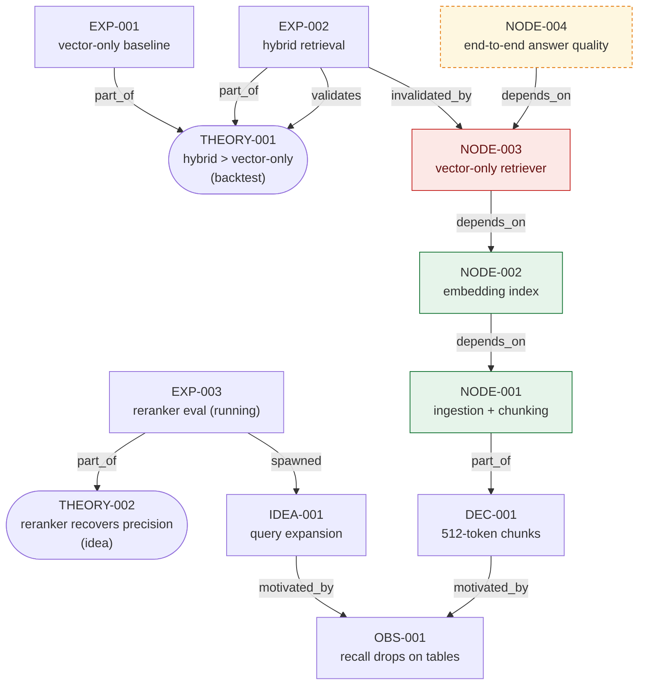

# doc-search — status

*Generated on demand from `graph/` by tendrel. Do not hand-edit — regenerate with
`/tendrel:status` (or "regenerate status.md").*

## Graph

> Legend: green = validated · red = invalidated · orange/dashed = blocked · stadium = theory (with lifecycle stage).

## Theories

- **THEORY-001** — hybrid keyword+vector beats vector-only. `backtest`, confidence **high**.
  Next gate: hybrid > vector-only by >5 pts nDCG → `paper_trade`. Supported by EXP-002.
- **THEORY-002** — a reranker recovers precision lost to chunking. `idea`, confidence moderate.
  Next gate: reranker recovers ≥80% of lost precision on 50 queries. Being tested by EXP-003.

## Pipeline nodes by evidence status

- **validated:** NODE-001 (ingestion + chunking), NODE-002 (embedding index)
- **invalidated:** NODE-003 (vector-only retriever — beaten by hybrid in EXP-002; being replaced)
- **blocked:** NODE-004 (end-to-end answer quality — waiting on the retriever replacement)

## Decisions

- **DEC-001** (active) — 512-token chunks, 64-token overlap. Best recall/latency trade-off.

## Open ideas

- **IDEA-001** — query expansion for table/figure queries (motivated by OBS-001).
